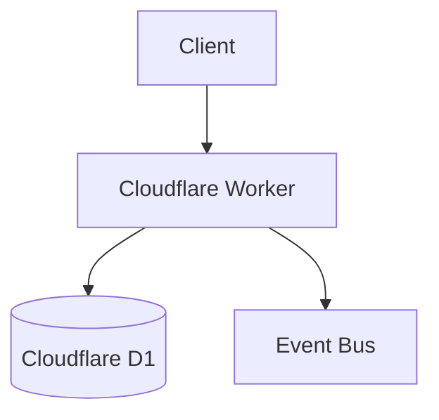

# Documentation Style Guide

**Owner:** WebWaka Platform Documentation Guild  
**Last Updated:** 2026-04-06  
**Applies To:** All content in `webwaka-platform-docs`

---

## Purpose

This guide defines the standards for writing, formatting, and structuring documentation in the WebWaka OS v4 platform docs repository. Following these standards ensures all documentation is consistent, accurate, and accessible — regardless of which team wrote it.

Read this guide before contributing. If you notice the guide itself diverging from what you see in existing docs, the guide takes precedence — raise a PR to bring existing docs into alignment.

---

## Voice & Tone

### Be direct

Write short, confident sentences. State what the system does, not what it "might" or "could" do.

| Instead of | Write |
|---|---|
| "The API could return an error if the token is invalid." | "The API returns a 401 error if the token is invalid." |
| "You might want to consider setting this value." | "Set this value to enable the feature." |
| "This is basically a wrapper around the Paystack SDK." | "This calls the Paystack API and enforces kobo integer amounts." |

### Use active voice

Passive voice obscures who or what does the action.

| Passive (avoid) | Active (prefer) |
|---|---|
| "A JWT is generated by the server." | "The server generates a JWT." |
| "The event is emitted when an order is placed." | "The platform emits an `order.placed` event when an order is placed." |

### Address the reader as "you"

Documentation is a conversation with the reader. Use second person.

> "You will need to set the `WEBWAKA_API_KEY` environment variable before running the server."

Not:

> "The developer must set the `WEBWAKA_API_KEY` environment variable."

### Respect global audiences

WebWaka OS v4 is built for Nigeria and Africa. Avoid idioms, metaphors, or cultural references that may not translate across regions. Write in plain global English.

Avoid:
- "Out of the box" → say "by default"
- "Ballpark figure" → say "approximate value"
- "Touch base" → say "contact" or "discuss"

---

## Markdown Formatting

### Headings

- Use ATX headings (`#` symbols). Never use Setext (underline) style.
- One `#` heading per document — it is the page title.
- Use sentence case for headings: "Getting started" not "Getting Started" (except acronyms and proper nouns).
- Do not skip heading levels (don't jump from `##` to `####`).
- Leave one blank line before and after every heading.

```markdown
# Page Title

## Major Section

### Subsection

#### Sub-subsection (use sparingly)
```

### Paragraphs and Lists

- One blank line between paragraphs.
- Use bullet lists (`-`) for unordered items. Do not use `*` for bullets.
- Use numbered lists (`1.`) for sequential steps where order matters.
- Do not nest lists more than two levels deep.
- Keep list items parallel in structure (all noun phrases or all verb phrases, not mixed).

**Good:**
```markdown
The deployment process involves three steps:

1. Configure environment variables.
2. Run the database migration.
3. Deploy the Worker.
```

**Avoid:**
```markdown
The deployment process:

1. Environment variables need configuring.
2. Run migration
3. You should then deploy
```

### Emphasis

| Markup | Use for |
|---|---|
| `**bold**` | UI labels, field names, key terms on first use, warnings |
| `_italic_` | Technical term being defined; title of a document or standard |
| `` `code` `` | Inline code: variable names, file paths, endpoint URLs, CLI commands, env var names |

Do not use bold or italic for general emphasis — restructure the sentence instead.

### Code Blocks

Always use fenced code blocks with a language identifier:

````markdown
```typescript
const token = await createJwt({ sub: userId, tenantId });
```
````

Supported language identifiers: `typescript`, `javascript`, `bash`, `json`, `sql`, `toml`, `yaml`, `markdown`, `text`.

Use `bash` for shell commands. Use `text` when the content is not a recognised language.

Every code example must be:
1. **Runnable** — no syntax errors or undefined variables without explanation
2. **Current** — verified against the actual system behaviour
3. **Complete enough** — include imports and context so the reader can follow it

Mark variables the reader must replace using `<ANGLE_BRACKETS>`:

```bash
curl -X POST https://api.webwaka.io/v4/orders \
  -H "Authorization: Bearer <YOUR_JWT_TOKEN>" \
  -H "Content-Type: application/json"
```

### Tables

Use tables for:
- Comparing options or configurations
- Listing API parameters, error codes, or permissions
- Showing structured data with two or more attributes

Table format:
```markdown
| Header 1 | Header 2 | Header 3 |
|---|---|---|
| Value | Value | Value |
```

- Always include a header row.
- Align column separators consistently.
- Keep cell content concise — link to fuller explanations rather than embedding paragraphs in cells.

### Links

Use descriptive link text. Never use "click here" or bare URLs as link text.

```markdown
See the [Webhooks Reference](../webhooks.md) for a full list of event types.
```

Not:
```markdown
See the webhook docs [here](../webhooks.md).
```

Internal links use relative paths from the current file's location. Test all links with `npm run check-links` before submitting.

### Callout Blocks

Use blockquotes for callouts. Always prefix with a label:

```markdown
> **Note:** This endpoint requires KYC tier2 or above.

> **Warning:** Do not store raw API keys in your codebase. Use environment variables.

> **Important:** All monetary amounts must be in kobo integers. Never use floats.
```

---

## Document Structure

### Page Template

Every documentation page should follow this general structure:

```markdown
# Page Title

**[Optional metadata: Version, Owner, Last Updated, Status]**

---

## Overview / Introduction

One paragraph describing what this page covers and who it is for.

---

## [Main sections]

## Related Documentation

- [Link 1]
- [Link 2]
```

### ADRs

Follow the canonical ADR template in `/content/adrs/adr-template.md`. See `CONTRIBUTING-ADR.md` for the full process.

### Deployment Guides

Structure deployment guides in this order:
1. Overview and architecture
2. Prerequisites (checklist format)
3. Environment variables
4. Local development setup
5. Deployment steps (staging, then production)
6. Monitoring
7. API reference (if applicable)
8. Troubleshooting

### API Documentation

For every function or endpoint, document:
- Purpose (one sentence)
- Parameters table (name, type, required, description)
- Return value and type
- Error codes it may throw
- A code example

### QA Reports

Use the template at `/content/qa-reports/vertical-qa-report-template.md`. Do not deviate from the section structure — consistency across reports is the goal.

---

## File Naming

| Content Type | Convention | Example |
|---|---|---|
| ADRs | `ADR-{NNN}-{kebab-case-title}.md` | `ADR-004-paystack-kobo-enforcement.md` |
| Deployment guides | `{service-name}.md` | `ai-platform.md` |
| QA reports | `{vertical}-qa-report-{YYYY-MM}.md` | `fintech-qa-report-2026-05.md` |
| QA report examples | `sample-{vertical}-qa-report.md` | `sample-commerce-qa-report.md` |
| Tutorials | `{NN}-{kebab-case-title}.md` | `04-offline-sync.md` |
| API docs | `{service}-api.md` | `core-api.md` |
| General guides | `{kebab-case-title}.md` | `contribution-guidelines.md` |

Numbers in ADR and tutorial filenames are **zero-padded** to three digits (ADRs) or two digits (tutorials) for correct alphabetical sorting.

---

## Language & Localisation

### English First

All documentation is authored in English first. Translations are secondary and generated via the `npm run translate` pipeline, then reviewed by native speakers.

Do not write original content directly in a translated language. Update the English source and re-run the translation pipeline.

### Translated Content

Translated files live at `/translations/{lang}/` mirroring the `content/` path structure.

Supported languages: `fr` (French), `sw` (Swahili), `ar` (Arabic).

---

## Terminology

Use consistent terminology throughout the documentation. If in doubt, prefer the term used in the codebase.

| Preferred | Avoid |
|---|---|
| tenant | customer account, organisation, company |
| staff | employee, worker |
| kobo | cents, pence, sub-unit |
| NGN / ₦ | naira (acceptable but prefer the symbol) |
| event bus | message queue, pub/sub |
| Worker | Lambda, function, serverless function |
| D1 | Cloudflare D1, the database |
| KYC tier | verification level |

---

## Diagrams

Use ASCII diagrams or Mermaid for architecture and flow diagrams embedded directly in Markdown:

````markdown

````

For complex diagrams that do not render well in Markdown, save as SVG in `/content/assets/` and embed with:

```markdown

```

Always include descriptive `alt` text for all images — this is required for accessibility and for readers using the raw Markdown.

---

## Review Checklist for Authors

Before submitting a PR, verify:

- [ ] All headings follow sentence case
- [ ] All code blocks have a language identifier
- [ ] All code examples are runnable and current
- [ ] All links are descriptive (no "click here")
- [ ] `npm run check-links` passes with no broken links
- [ ] Active voice used throughout
- [ ] No placeholder text (`[TODO]`, `[PLACEHOLDER]`) left in the document
- [ ] File is named following the naming convention above
- [ ] Page includes a "Related Documentation" section if applicable
